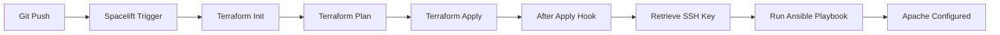

# Spacelift Stack Configuration Guide

## Stack Setup

### 1. Create New Stack
- **Name:** `gcp-ansible-demo`
- **VCS Integration:** Connect to this repository
- **Branch:** `main`
- **Project Root:** `/`

### 2. Environment Variables

Add these in Stack → Settings → Environment:

```bash
# Required
TF_VAR_project = "your-gcp-project-id"
GOOGLE_APPLICATION_CREDENTIALS = "/mnt/workspace/service-account.json"

# Optional (use defaults from variables.tf)
TF_VAR_region = "us-central1"
TF_VAR_zone = "us-central1-a"
```

### 3. Mounted Files

Add your GCP service account JSON:
- **Name:** `service-account.json`
- **Path:** `/mnt/workspace/service-account.json`
- **Content:** Paste your GCP service account JSON key

### 4. Hooks Configuration

**After Apply Hook:**
- File: `.spacelift/after_apply.sh`
- Purpose: Automatically runs Ansible after Terraform apply
- Enabled by default if file exists

### 5. Required GCP Permissions

Your service account needs these IAM roles:
- `roles/compute.admin` - Compute Engine management
- `roles/secretmanager.admin` - Secret Manager access
- `roles/iam.serviceAccountUser` - Service account operations

### 6. Workflow



## Testing Locally

Before pushing to Spacelift:

```bash
# 1. Test Terraform
terraform init
terraform plan
terraform apply

# 2. Test Ansible separately
cd ansible
export GCP_PROJECT="your-project-id"
ansible-playbook -i gcp_compute_inventory.yml playbook.yml

# 3. Full flow test
./deploy.sh
```

## Triggering Deployments

### Automatic Triggers:
- Push to `main` branch
- Pull request (plan only)

### Manual Triggers:
- Spacelift UI → "Trigger" button
- Spacelift API/CLI

## Monitoring

Check these in Spacelift UI:
- **Runs:** View Terraform apply logs
- **Outputs:** See instance IP, secret name
- **Resources:** List of managed resources
- **State:** Current Terraform state

## Common Issues

**Hook Not Running:**
- Verify `.spacelift/after_apply.sh` has execute permissions
- Check Spacelift logs for hook execution errors

**SSH Connection Failed:**
- Increase wait time in after_apply.sh
- Check firewall rules allow port 22
- Verify SSH key in Secret Manager

**Ansible Inventory Empty:**
- Check GCP authentication in Spacelift
- Verify instance has label `managed_by=ansible`
- Confirm instance is RUNNING

## Advanced: Using Spacelift API

Trigger run via API:

```bash
curl -X POST "https://your-account.app.spacelift.io/graphql" \
  -H "Authorization: Bearer YOUR_API_TOKEN" \
  -d '{
    "query": "mutation { runPropose(stack: \"gcp-ansible-demo\") { id } }"
  }'
```

## Cleanup

Destroy infrastructure:
1. Spacelift UI → Stack → "Destroy" task
2. Or: `terraform destroy` locally

## Support

- [Spacelift Documentation](https://docs.spacelift.io/)
- [Terraform GCP Provider](https://registry.terraform.io/providers/hashicorp/google/latest/docs)
- [Ansible Documentation](https://docs.ansible.com/)
